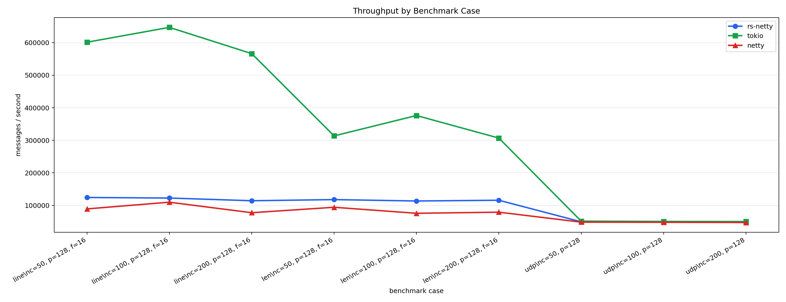
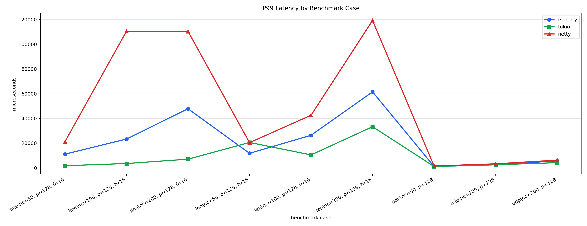
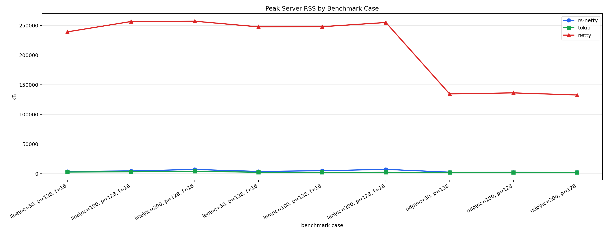
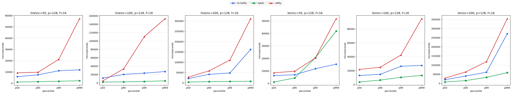

# rs-netty

Tokio-native typed TCP/UDP pipelines inspired by Netty.

`rs-netty` keeps the familiar Channel / Pipeline / Handler model, but rebuilds
it around Rust ownership, async/await, Tokio tasks, bounded queues, and typed
messages. The result is a small network framework where invalid pipeline order,
message mismatches, and TCP/UDP pipeline mixups are caught at compile time.

## Benchmark Snapshot

These charts come from the benchmark harness in `benchmarks/`, comparing
`rs-netty`, bare Tokio, and Java Netty on one local non-loopback interface. They
are useful as a directional snapshot, not a universal performance claim.

### Throughput



### P99 Latency



### Server Memory



### Latency Percentiles



## Why rs-netty?

- **Netty-shaped, Rust-native**: keep codec, pipeline, handler, channel, and
  lifecycle concepts without Java futures, promises, object messages, or
  reference-counted `ByteBuf`.
- **Typed pipeline construction**: `codec -> inbound* -> business* -> handler
  -> outbound*` is encoded in the builder API. Invalid stage order simply does
  not type-check.
- **TCP and UDP support**: stream pipelines for TCP, datagram pipelines for UDP,
  with separate builder types so they cannot be accidentally mixed.
- **No dynamic handler dispatch on the main path**: the default pipeline is built
  from generic static stages rather than `Box<dyn Handler>`.
- **Practical batteries included**: built-in line, length-field, delimiter,
  fixed-length, byte-array, MQTT, UTF-8 datagram, and bytes datagram codecs.
- **Operational hooks when you need them**: optional lifecycle hooks, idle
  timeout, graceful shutdown handles, bounded outbound queues, and opt-in TCP
  connection stats.

## Quick Start

Add the crate:

```toml
[dependencies]
rs-netty = "0.2"
tokio = { version = "1", features = ["rt-multi-thread", "macros"] }
```

Build a TCP echo server:

```rust
use rs_netty::{codec::LineCodec, pipeline, Context, Handler, Result, TcpServer};

#[tokio::main]
async fn main() -> Result<()> {
    TcpServer::bind("127.0.0.1:9000")
        .pipeline(|| pipeline().codec(LineCodec::new()).handler(Echo))
        .run()
        .await
}

struct Echo;

impl Handler<String> for Echo {
    type Write = String;

    async fn read(&mut self, ctx: &mut Context<Self::Write>, msg: String) -> Result<()> {
        ctx.write(msg).await
    }
}
```

Talk to it with a typed TCP client:

```rust
use rs_netty::{codec::LineCodec, pipeline, Context, Handler, Result, TcpClient};

#[tokio::main]
async fn main() -> Result<()> {
    let client = TcpClient::connect("127.0.0.1:9000")
        .pipeline(|| pipeline().codec(LineCodec::new()).handler(PrintResponse))
        .run()
        .await?;

    client.write("hello".to_string()).await?;
    client.close().await?;
    client.wait().await
}

struct PrintResponse;

impl Handler<String> for PrintResponse {
    type Write = String;

    async fn read(&mut self, _ctx: &mut Context<Self::Write>, msg: String) -> Result<()> {
        println!("server -> {msg}");
        Ok(())
    }
}
```

## Typed Pipelines

TCP uses a stream pipeline:

```text
pipeline()
  .codec(...)
  .inbound(...)*
  .business(...)*
  .handler(...)
  .outbound(...)*
```

UDP uses a datagram pipeline:

```text
datagram_pipeline()
  .codec(...)
  .inbound(...)*
  .business(...)*
  .handler(...)
  .outbound(...)*
```

Methods only exist in valid states. Message transitions are checked with trait
bounds, so handler inputs must match previous stage outputs, outbound inputs
must match `Handler::Write` or `DatagramHandler::Write`, and final outbound
types must be encodable by the selected codec.

`TcpServer` and `TcpClient` only accept stream pipelines. `UdpServer` and
`UdpClient` only accept datagram pipelines.

## UDP Example

```rust
use rs_netty::{
    codec::Utf8DatagramCodec, datagram_pipeline, DatagramContext, DatagramHandler, Result,
    UdpServer,
};

#[tokio::main]
async fn main() -> Result<()> {
    UdpServer::bind("127.0.0.1:9002")
        .pipeline(|| datagram_pipeline().codec(Utf8DatagramCodec).handler(UdpEcho))
        .run()
        .await
}

struct UdpEcho;

impl DatagramHandler<String> for UdpEcho {
    type Write = String;

    async fn read(&mut self, ctx: &mut DatagramContext<Self::Write>, msg: String) -> Result<()> {
        ctx.write(format!("echo: {msg}")).await
    }
}
```

UDP support is datagram-oriented. `UdpServer` uses one socket-level pipeline and
does not create per-peer child pipelines. If you need per-peer state, store it
explicitly inside your handler, for example with `HashMap<SocketAddr, PeerState>`.

`DatagramContext::write(msg)` replies to the current datagram peer.
`DatagramContext::write_to(peer, msg)` and `DatagramChannel::write_to(peer, msg)`
send to an explicit peer.

## Lifecycle and Operations

Servers and clients can attach optional lifecycle hooks with `.life(...)`. The
default is `NoLife`, so applications that do not need hooks pay no dynamic
dispatch cost.

```rust
use std::net::SocketAddr;

use rs_netty::{codec::LineCodec, pipeline, Life, Result, TcpServer};

#[derive(Clone, Copy)]
struct TraceLife;

impl Life for TraceLife {
    async fn tcp_server_started(&self, local_addr: SocketAddr) -> Result<()> {
        tracing::info!(%local_addr, "tcp server started");
        Ok(())
    }
}

TcpServer::bind("127.0.0.1:9000")
    .pipeline(|| pipeline().codec(LineCodec::new()).handler(MyHandler))
    .life(TraceLife)
    .run()
    .await
```

Servers also support an external shutdown handle:

```rust
let server = TcpServer::bind("127.0.0.1:9000")
    .pipeline(|| pipeline().codec(LineCodec::new()).handler(MyHandler))
    .start()
    .await?;

server.shutdown();
server.wait().await?;
```

TCP servers and clients can enable an optional idle timeout:

```rust
TcpServer::bind("127.0.0.1:9000")
    .idle_timeout(std::time::Duration::from_secs(90))
    .pipeline(|| pipeline().codec(LineCodec::new()).handler(MyHandler))
    .run()
    .await
```

When no idle timeout is configured, the TCP connection loop uses the no-timeout
path and does not create a timer.

TCP connection stats are opt-in:

```rust
TcpServer::bind("127.0.0.1:9000")
    .track_connection_stats()
    .pipeline(|| pipeline().codec(LineCodec::new()).handler(MyHandler))
    .run()
    .await
```

When enabled, `Context::stats()` and `Channel::stats()` expose connection time,
bytes read/written, and frames read/written. Channels also expose `is_closed()`,
`capacity()`, and `max_capacity()` from the underlying Tokio queue.

## Built-In Codecs

Stream codecs:

- `LineCodec`
- `LengthFieldBasedFrameDecoder`
- `LengthFieldPrepender`
- `FixedLengthFrameDecoder`
- `DelimiterBasedFrameDecoder`
- `ByteArrayDecoder`
- `ByteArrayEncoder`
- `MqttCodec`

Datagram codecs:

- `Utf8DatagramCodec`
- `BytesDatagramCodec`

## Benchmarks

The repository includes benchmark harnesses for `rs-netty`, bare Tokio, and
Java Netty under `benchmarks/`. They measure throughput, p50/p90/p99/p999
latency, and server RSS across TCP line echo, TCP length-field echo, and UDP
echo scenarios.

```bash
python3 benchmarks/run.py \
  --impls rs-netty tokio netty \
  --protocols line len udp \
  --connection-values 50 100 200 \
  --messages 100000 \
  --payload-values 128 \
  --in-flight-values 16 \
  --output-dir benchmarks/results
```

Benchmark results depend heavily on host, network path, JVM warmup, payload
shape, and protocol behavior. Treat the included chart as a snapshot from one
local run, not a universal performance claim.

## Examples

```bash
cargo run --example tcp_echo_server
cargo run --example tcp_echo_client
cargo run --example tcp_typed_chain
cargo run --example tcp_typed_chain_client
cargo run --example tcp_lifecycle
cargo run --example udp_echo_server
cargo run --example udp_echo_client
cargo run --example udp_typed_chain
cargo run --example udp_typed_chain_client
```

## Non-Goals

Non-goals for v0.2:

- No EventLoop API.
- No ByteBuf refCnt API.
- No ChannelFuture / Promise API.
- No dynamic `Box<dyn Handler>` main path.
- No TLS yet.
- No codec registry yet.
- No automatic UDP reliability / ordering / retransmission.
- No per-peer UDP child pipeline yet.
